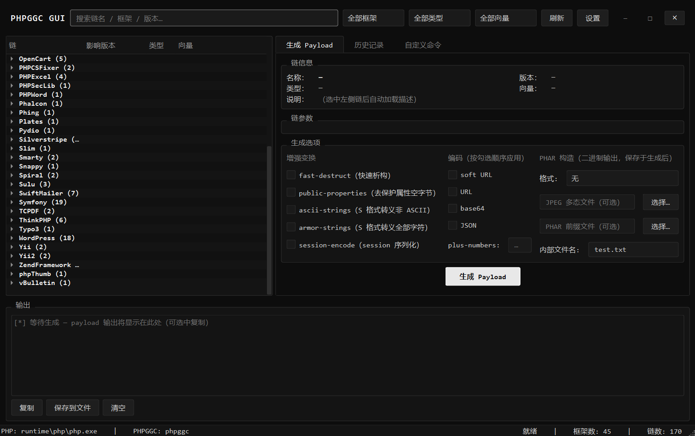

# PHPGGC GUI

[English](README.md) | 中文

一个 Windows 平台的 **PHPGGC 图形化工具箱**，开箱即用、完全便携。

---

## 为什么做这个

[PHPGGC](https://github.com/ambionics/phpggc) 是最全的 PHP 反序列化漏洞利用链集合，但它只有 Linux/macOS 命令行版本：在 Windows 上需要自行安装 PHP、处理 `phar.readonly` 等配置，对不熟悉 PHP 环境的人来说比较麻烦。

**PHPGGC GUI 解决的就是这个问题**：PHP 运行时、Python 运行时全部内置在项目里，克隆/下载后双击即用，不写注册表、不加环境变量、不改任何系统配置。

<a href="picture/homepage.png"></a>

## 特性

- **原生桌面界面**（PySide6），暗黑无边框窗口，顶栏拖动、双击最大化
- **45 个框架 / 170+ 条链**：树形浏览，实时搜索，按框架 / 漏洞类型 / 触发向量筛选
- **动态参数表单**：选中链自动解析其说明与参数名，无需记忆命令行用法
- **全量选项**：base64 / URL / JSON 编码，fast-destruct、ascii-strings、plus-numbers、session-encode、PHAR 构造（含 JPEG 多态）等
- **历史记录**：自动保存最近 200 条生成结果，可复制 / 导出
- **自定义命令**：直接透传 phpggc 任意命令行参数（如 `-w` 包装器）
- **完全便携**：自带运行时，拷走整个文件夹即可在别的机器使用

## 使用方法

1. 双击 **`start.bat`** 即可
2. 出问题用 `debug mode.bat` 启动查看报错

**系统要求**：Windows 10/11 x64（运行时已自带，无需安装任何东西）

## 工作原理

- GUI 使用 **PySide6 (Qt6)** 编写，通过子进程调用 `php phpggc`，phpggc 本体零改动，替换 `phpggc/` 目录即可升级
- PHP 以 `php -n -d phar.readonly=0` 运行：忽略一切 php.ini，所需扩展（phar/zlib/json/hash）在 Windows 构建中均为内置模块，因此天然免配置
- 链列表解析自 `phpggc -l`，链参数与说明解析自 `phpggc -i <chain>`，payload 生成即对应 CLI 调用
- 配置 / 历史记录保存在 `data/`（首次运行自动创建）

## 项目结构

```
phpggc-gui/
├── app/                 # GUI 源码 (PySide6)
├── runtime/
│   ├── php/             # 内置便携 PHP
│   └── python/          # 内置便携 Python + PySide6
├── phpggc/              # phpggc 原项目（未改动）
├── picture/             # README 截图
├── tests/               # 无边框窗口交互测试
├── start.bat            # 启动
└── debug mode.bat       # 调试启动（带控制台）
```

> 说明：仓库体积主要来自 `runtime/`（约 340MB）。如果你只想要源码，删除该目录后按 `app/` 内 import 自行准备环境亦可；正常使用建议保留。

## 免责声明

本项目仅用于**已授权**的安全测试、CTF 竞赛与安全研究。使用本工具产生的任何后果由使用者自行承担。

## 致谢

- [PHPGGC](https://github.com/ambionics/phpggc) — [ambionics](https://www.ambionics.io/) 出品的序列化利用链库，本项目根据它进行二次开发，适配 Windows 系统
